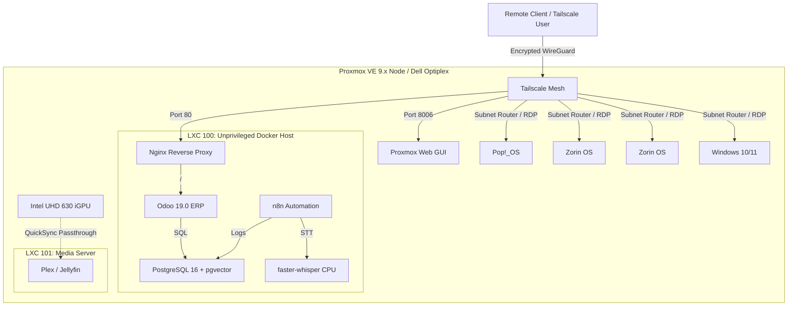

# pve-node-iac

> Infrastructure as Code (IaC) repository for provisioning, tuning, and orchestrating a Proxmox VE single-node home lab environment. This repository directly manages the bare-metal host configuration, the unprivileged nesting container layer, and the application deployment stack.

---

## ⚠️ Important Disclaimer

This is a **personal / home lab project**. It is in a **pre-alpha research and design phase** — nothing here has been tested on real hardware yet.

- **Educational value:** You may learn from the architecture, decisions, and patterns documented here.
- **Not production-ready:** Code and configuration may contain errors, omissions, or outdated assumptions.
- **No warranty:** There is no guarantee of correctness, safety, or fitness for any purpose.
- **Verify before use:** If you are an IT professional considering any of these patterns, review the canonical IaC files yourself and validate against your own environment.
- **Feedback welcome** but this project is not open for external contributions.

> See [MANUAL.md](MANUAL.md) for the deployment tutorial and [docs/](docs/README.md) for architectural rationale.

---

## 🏗️ Core Stack

> For a complete technology catalog, visit the [STACK_BADGES](STACK_BADGES.md) page.

---

## 🗺️ Visual Component Map

---

## 📄 Description and Context

A single-node Proxmox VE home lab on a Dell Optiplex 3060 (i5-9500T, 32 GB RAM, 480 GB SSD). The architecture consolidates a family multi-tenant KVM workstation layer with an AI-augmented ERP stack (Odoo 19 + PostgreSQL 16 + pgvector + n8n + faster-whisper) into unprivileged LXC nesting containers with strict resource caps and zero-exposure networking via Tailscale.

IaC artefacts live as real files in `docker/`, `proxmox/`, and `scripts/`. Each major area keeps its own README so the knowledge graph can scale without overloading this root page.

---

## 🔗 System Links

| Area                               | Description                                                             |
| ---------------------------------- | ----------------------------------------------------------------------- |
| [MANUAL.md](MANUAL.md)             | English step-by-step deployment tutorial (Dell Optiplex)                |
| [docs/](docs/README.md)            | Architecture, hardware, resource budget, host tuning, disaster recovery |
| [docker/](docker/README.md)        | Odoo + AI + PostgreSQL Compose stack (canonical)                        |
| [proxmox/](proxmox/README.md)      | LXC container profiles and Tailscale network configuration              |
| [scripts/](scripts/README.md)      | Host tuning and stack deployment automation                             |
| [archive/](archive/README.md)      | Legacy PoC notes, historical IaC drafts, hardware pivot rationale       |
| [STACK_BADGES.md](STACK_BADGES.md) | Technology badge catalog (shields.io)                                   |
