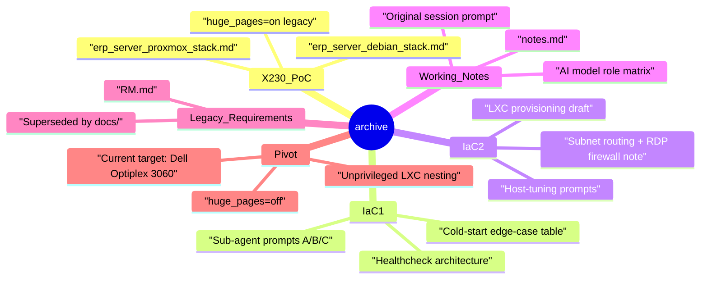

# archive

> Historical drafts, legacy hardware PoC notes and earlier IaC proposals.

## 🗺️ Visual Component Map

## 📄 Description and Context

This folder contains read-only historical reference files. They document the journey from the original ThinkPad X230 proof-of-concept to the current Dell Optiplex 3060 design.

Files in this archive:

* `erp_server_proxmox_stack.md` — legacy X230 Proxmox PoC manual (huge_pages=on, 16 GB RAM).
* `erp_server_debian_stack.md` — legacy X230 KVM-on-Debian PoC script set.
* `IaC1.md` — first IaC spec draft with sub-agent prompts A/B/C and healthcheck architecture.
* `IaC2.md` — second, simpler IaC spec draft.
* `notes.md` — original working notes, AI model role matrix, embedded Phase-2 prompt.
* `RM.md` — legacy requirements matrix, superseded by `docs/`.
* `zahajovací_prompt.md` — original session initiation prompt.

Placeholder passwords found in these files (`velmi_bezpecne_heslo`, `moje_super_bezpecne_heslo`, `vase_top_heslo`) are historical and must never be reused.

Key pivot decisions recorded here:

* Replaced `huge_pages=on` with `huge_pages=off` because unprivileged LXC containers cannot manage host hugepage namespaces.
* Moved from a dedicated Ubuntu KVM to an unprivileged LXC 100 nesting container to save ~2 GB of RAM.
* Adopted `ext4` on LVM-Thin instead of ZFS to reduce write amplification and ARC memory pressure.

## 🔗 System Links

* **Parent context:** [README](../README.md)
* **Dependencies:** none — these are read-only reference files
