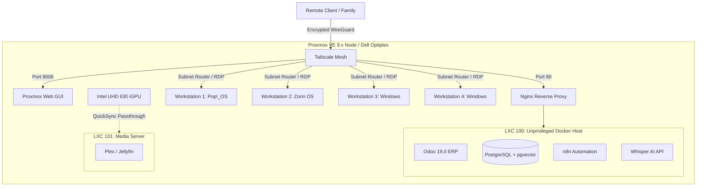

# Proxmox VE Single-Node IaC (Home Lab & Family ERP)

> **Infrastructure as Code repository** for provisioning, tuning, and orchestrating a highly available, resource-constrained Proxmox VE environment. This project demonstrates enterprise-grade architectural patterns (strict resource isolation, zero-exposure networking, unprivileged container nesting) deployed on consumer-grade hardware to serve as a multi-tenant family workspace and an AI-augmented ERP stack.

## 🎯 Project Objectives

1. **Multi-Tenant Coexistence:** Seamlessly host 4 independent family workstations (KVM) alongside a production-grade business ERP (LXC/Docker) without resource starvation.
2. **Strict OOM Prevention:** Implement hard memory limits and cgroup tuning to ensure the Proxmox host kernel never invokes the OOM Killer, protecting adjacent family VMs from business-tier workload spikes.
3. **Security & Zero Exposure:** Route all external traffic through an encrypted Tailscale mesh and isolate internal services behind an Nginx reverse proxy. No ports are exposed to the public internet.
4. **Hardware Efficiency:** Maximize the utility of a 35W TDP Intel CPU by leveraging iGPU QuickSync for media transcoding and LXC nesting to minimize virtualization overhead.

## 🏗️ High-Level Architecture



## 🧠 Key Engineering Decisions

- **The Sandbox Strategy (LXC vs. KVM for ERP):** Instead of splitting Odoo and PostgreSQL into heavy, isolated KVM VMs, the entire application runtime is consolidated into a single, high-efficiency Unprivileged LXC container with Docker Nesting. This eliminates the KVM memory overhead (saving ~2GB RAM) while maintaining strict cgroup isolation from the host.
- **Unprivileged Nesting:** Docker runs inside an unprivileged LXC (`unprivileged: 1`, `features: nesting=1,keyctl=1`). This avoids granting `CAP_SYS_ADMIN` to the container root, mitigating container-escape vulnerabilities while allowing modern Docker features.
- **File System Selection:** `ext4` on top of Proxmox `LVM-Thin` was selected over `ZFS`. On a single-node, 32GB RAM consumer setup, ZFS ARC overhead and write amplification on a single SSD would degrade performance and lifespan. LVM-Thin provides sufficient snapshot capabilities for VZDump with minimal RAM footprint.

## 📦 The Application Stack (`docker/compose.yaml`)

The production-ready Compose specification manages the AI-ERP ecosystem inside the nesting container layer. It features:
- **Hard Memory Caps:** Docker services are strictly limited via `deploy.resources.limits.memory` to prevent the LXC from breaching its Proxmox-assigned RAM ceiling.
- **pgvector Integration:** PostgreSQL is initialized with the `pgvector` extension to support AI-driven semantic search and RAG (Retrieval-Augmented Generation) pipelines within Odoo.
- **Zero Exposure Topology:** Odoo, n8n, and Whisper are bound to `127.0.0.1` or an internal Docker network, accessible only via the Nginx reverse proxy.

## 📚 Documentation Index

Detailed technical documentation, tuning parameters, and recovery procedures are maintained in the `docs/` directory:

- [ARCHITECTURE](../docs/ARCHITECTURE.md) - Deep dive into network topology, VLANs, and design patterns.
- [HARDWARE](../docs/HARDWARE.md) - Bill of Materials, thermal constraints, and physical limitations.
- [RESOURCE-BUDGET](../docs/RESOURCE-BUDGET.md) - The exact 32GB RAM allocation matrix and CPU pinning strategy.
- [HOST-TUNING](../docs/HOST-TUNING.md) - Mandatory `sysctl`, `grub`, and LXC configuration tweaks.
- [DISASTER-RECOVERY](../docs/DISASTER-RECOVERY.md) - Backup schedules, Proxmox Backup Server (PBS) integration, and RTO/RPO metrics.

## 🚀 Deployment & Recovery

For bare-metal provisioning or disaster recovery scenarios, refer to the automation scripts:

```bash
# 1. Provision the bare-metal Proxmox host
./scripts/setup-host.sh

# 2. Deploy the Docker stack inside LXC 100
./scripts/deploy-stack.sh --env production
```

---
*Note: This repository serves as a personal infrastructure archive and architectural portfolio. It is not open for external contributions.*