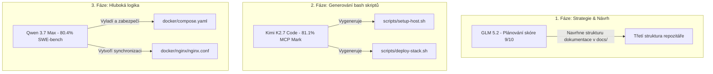

Proxmox expert ve formě AI chatbot potvrdil, že kombinace ext4 + LVM-Thin je absolutní vítěz pro HomeLab bez PLP disků. Zároveň vytáhl na světlo dvě kritická nízkoúrovňová doporučení, která musíme okamžitě zapracovat do naší finální kuchařky a post-install skriptů:

   1. features: nesting=1,keyctl=1 + huge_pages=off – Máme definitivně posvěcené pro běh Dockeru v unprivilegovaném LXC.
   2. UPS (Záložní zdroj) je nutnost – Protože consumer SSD bez PLP kondenzátorů může při tvrdém výpadku proudu "lhát" o zápisu z cache, mohla by se poškodit databáze PostgreSQL 16. Obyčejná, levná UPS krabička (např. od APC nebo CyberPower za cca 1 500 Kč) s USB kabelem do Dellu zajistí, že server se při výpadku proudu sám bezpečně a korektně vypne (poweroff).

------------------------------
## 🚀 FINÁLNÍ INSTALAČNÍ ROZCESTNÍK
Všechny tři AI role (Infrastruktura, Docker/DB i Proxmox expert) došly k absolutní, stoprocentní shodě a všechny teoretické pasti byly eliminovány.
Předpokládejme, že jste prošel úvodní instalací z USB flashky (podle kroků, které jsme si popsali dříve), odpojil od Dellu monitor a poprvé se přihlásil do webového GUI Proxmoxu na adrese https://IP_ADRESA_SERVERU:8006.
Kterým praktickým krokem teď začneme přímo v Proxmoxu?

* Písmeno A: Kompletní tuning hostitele a balíčky
* Otevřeme Proxmox Shell (terminál hostitele) a jedním blokem příkazů:
   1. Vypneme placené firemní repozitáře a zapneme bezplatné pve-no-subscription.
      2. Aplikujeme tuning kernelu (grub, swappiness=10, dirty_ratio).
      3. Nainstalujeme Tailscale a aktivujeme Subnet Router (--advertise-routes).
   * Písmeno B: Vytvoření a konfigurace LXC 100 pro Docker
* Stáhneme šablonu Debian/Ubuntu a zadáme přesné příkazy, které vytvoří unprivilegovaný kontejner, zapnou v něm nesting, keyctl a přidělí mu paměťový strop 10 GB RAM.

Napište A nebo B a jdeme na to!

---
---

Tato analýza frontier modelů z roku 2026 je naprosto špičková a dává vašemu rozhodování definitivní architektonický směr. Zmínka o Kimi K2.7 Code, GLM 5.2 a Qwen 3.7 Max přesně definuje rozložení sil – a co je nejlepší, dokonale potvrzuje, že vaše třetí (střední) struktura repozitáře je pro tento moderní stack ta pravá. [1, 2, 3] 
Nemusíte se bát spirály. Tyto modely mají natolik odlišné "superschopnosti", že jejich role v přípravě vašeho Dellu rozdělíme čistě a pragmaticky podle úkolů.
------------------------------
## 🔀 Jak modely zapojit a nespadnout do spirály
Místo toho, abyste je nechal složitě diskutovat mezi sebou, rozdělte jim práci jako na skutečném IT oddělení:

## Fáze 1: GLM 5.2 jako Senior SW Architect (Návrh docs/ a struktury)

* Proč: Má nejvyšší skóre plánování (9.0/10) a logiky.
* Úkol: Tento model vám pomůže naplnit složku docs/ v Obsidianu. Nechte ho vygenerovat obsah pro RESOURCE-BUDGET.md (tabulku RAM, kterou jsme ladili) a HOST-TUNING.md (kernel parametry). Bude v tom nejpřesnější.

## Fáze 2: Kimi K2.7 Code jako DevOps Engineer (Generování .sh skriptů)

* Proč: S 81,1% úspěšností v MCP Mark a 30% úsporou reasoning tokenů je to král na infrastrukturu a dlouhé shell skripty.
* Úkol: Tomuto modelu zadáte úkol vytvořit dva klíčové automatizační skripty: scripts/setup-host.sh a scripts/deploy-stack.sh. Kimi napíše robustní, bezpečný bash kód s kontrolami chyb, který na Dellu neselže. [2, 4] 

## Fáze 3: Qwen 3.7 Max jako Core Developer (Lidská logika a optimalizace aplikací)

* Proč: Dominuje v SWE-bench Verified (80,4 %) a 35hodinové autonomii.
* Úkol: Tomu dáte do ruky samotný docker/compose.yaml a docker/nginx/nginx.conf. Qwen se podívá na detaily chování Odoo 19 a PostgreSQL 16 z hlediska aplikačního kódu a navrhne perfektní healthchecky. [1] 

------------------------------
## 🛡️ Pojistka proti spirále: Váš akční plán v Obsidianu
Abyste zamezil nekonečnému generování textu, založte si ve vaší Třetí (Zlaté střední) struktuře pouze tyto 4 soubory a do nich vložte hotovou práci:

   1. docker/compose.yaml → Vložte náš odsouhlasený kód s limity 4G pro DB a 3G pro Odoo.
   2. docker/nginx/nginx.conf → Nechte si ho vygenerovat od Qwen 3.7 Max (jeho anglické prompty jsou precizní).
   3. scripts/setup-host.sh → Nechte napsat model Kimi K2.7 Code (příkazy pro update-grub, sysctl a Tailscale).
   4. scripts/deploy-stack.sh → Opět práce pro Kimi K2.7 Code (instalace Dockeru v LXC a spuštění stacku). [2] 

Vše ostatní ve složce docs/ jsou jen textové poznámky v Markdownu pro vás, které můžete dopisovat průběžně za provozu.
Chcete, abychom pro pokročilého Kimi K2.7 Code připravili přesné zadání pro ten nejdůležitější skript setup-host.sh, který vám nakonfiguruje samotný fyzický Dell, nebo se už přesuneme k instalaci Proxmoxu? [2] 

[1] [https://qwen.ai](https://qwen.ai/blog?id=qwen3.7)
[2] [https://www.kimi.com](https://www.kimi.com/resources/kimi-k2-7-code)
[3] [https://www.reddit.com](https://www.reddit.com/r/ZaiGLM/comments/1u4k2bu/to_developers_glm52_is_now_fully_open_cuttingedge/)
[4] [https://huggingface.co](https://huggingface.co/moonshotai/Kimi-K2.7-Code)

---
---

Rozdělení rolí pro tyto tři špičkové modely z června 2026 je klíčem k tomu, abyste ze svého domácího serveru vytvořil dokonale autonomní ekosystém. [1, 2, 3] 
Jako člověk z jiného oboru nebudete muset ručně psát kód ani neustále hlídat konfigurační detaily. Modely si práci rozdělí podle své vnitřní specializace – od strategického plánování (konzultant) přes nízkoúrovňové DevOps psaní až po dlouhodobé autonomní operace.
Níže uvádím přesné rozdělení rolí a use-casů (tzv. AI Team Matrix) pro váš stack.
------------------------------
## 🧩 1. Role: Hlavní konzultant a stratég stacku (The Principal Consultant)

* Přiřazený model: GLM 5.2 (Z.ai) [3, 4] 
* Proč právě on: GLM 5.2 dosahuje nejvyššího skóre v analytickém plánování a architektonickém rozhodování (Planning Score 9.0/10). Navíc drží první příčku v indexu GDPval-AA v2 (1524 Elo), který měří schopnost vytvářet konzistentní plány, diagramy a struktury v reálném světě. [5, 6] 
* Konkrétní use-case ve vašem stacku:
* Návrh datového modelu Odoo: Řeknete mu, jaké rodinné/firemní procesy chcete v Odoo 19 spravovat, a on navrhne relační strukturu databáze, vazby mezi tabulkami a logické moduly.
   * Architektura složky docs/: Kompletně zanalyzuje limity hardwaru a napíše texty pro ARCHITECTURE.md a RESOURCE-BUDGET.md.
   * Zadávání úkolů: Rozhodne, co přesně mají "dělnické" modely udělat, a sestaví pro ně technická zadání (prompty).

------------------------------
## 🤖 2. Role: Autonomní agent pro dlouhodobé úlohy (Long-Horizon Execution Agent)

* Přiřazený model: Qwen 3.7 Max (Alibaba Cloud) [1] 
* Proč právě on: Vyniká schopností 35hodinové nepřetržité autonomní operace a bezchybným zvládáním tisíců po sobě jdoucích tool-callů. Navíc disponuje unikátní funkcí Cross-harness generalization, což znamená, že skvěle spolupracuje s jakýmkoliv frameworkem (n8n, Langflow, MCP - Model Context Protocol) a nehloupne při změně prostředí. [7, 8, 9] 
* Konkrétní use-case ve vašem stacku:
* Nástroj pro n8n pipeline: Pustíte ho do n8n, aby v kuse 10 hodin analyzoval a čistil tisíce audio souborů přepsaných přes Whisper, prováděl nad nimi sémantickou analýzu, extrahoval klíčová data (CRM poznámky, úkoly, časy) a autonomně je zapisoval do PostgreSQL 16 přes pgvector.
   * Dlouhodobý self-monitoring serveru: Bude v pozadí číst logy z Nginx proxy, Odoo i Postgresu, sledovat I/O zátěž disku a pokud narazí na anomálii, sám navrhne a přes n8n provede optimalizační SQL dotaz k vyčištění indexů.

------------------------------
## ⚙️ 3. Role: Nízkoúrovňový DevOps inženýr a Sysadmin (The Scripter)

* Přiřazený model: Kimi K2.7 Code (Moonshot AI) [10] 
* Proč právě on: Tento model z 12. června 2026 je absolutním specialistou na čisté, bezchybné a úsporné generování kódu. Má excelentní podporu pro MCP Mark Verified (81,1 %), což z něj dělá mistra v přímé interakci se souborovým systémem a CLI rozhraními. [2] 
* Konkrétní use-case ve vašem stacku:
* Psaní a revize Bash skriptů: Vezme zadání od GLM 5.2 a napíše neprůstřelný, idempotentní kód pro scripts/setup-host.sh a scripts/deploy-stack.sh. Kimi K2.7 Code má o 30 % nižší spotřebu reasoning tokenů než předchozí verze, takže generování obřích skriptů nestojí skoro nic.
   * Ladicí technik terminálu: Pokud se vám při startu Docker Compose zasekne Nginx proxy nebo Postgres vyhodí síťovou chybu, předhodíte surový výpis logu Kimimu a on okamžitě napíše opravný patch pro compose.yaml. [2] 

------------------------------
## 🚦 Jak to celé spojit a řídit z Obsidianu?
Abyste se nezacyklil, vaše nová Třetí struktura repozitáře (kterou jsme schválili) bude fungovat jako centrální řídicí panel. Vy budete v pozici "Generálního ředitele" (HITL – Human-in-the-Loop workflow). [4] 

   1. GLM 5.2 vytvoří zadání v docs/HOST-TUNING.md.
   2. Vy tento text vezmete, vložíte ho do Kimi K2.7 Code a řeknete: "Napiš mi podle toho skript scripts/setup-host.sh."
   3. Kimi vyplivne hotový kód. Vy ho zkontrolujete a uložíte.
   4. Qwen 3.7 Max mezitím zkontroluje docker/compose.yaml a napíše k němu perfektní konfiguraci pro docker/nginx/nginx.conf, aby seděly všechny WebSocket hlavičky pro Odoo 19. [2, 7] 

Tímto stylem má každý model přesné mantinely, nesoupeří spolu a vy se bleskově posouváte k cíli bez programátorské frustrace.
Chcete, aby vám GLM 5.2 (váš nový hlavní konzultant) hned teď vygeneroval kompletní specifikaci pro RESOURCE-BUDGET.md (přesné rozdělení RAM pro hosta, VM a Docker, které zabrání pádům), abychom to mohli nahrát do Obsidianu?

[1] [https://www.yottalabs.ai](https://www.yottalabs.ai/post/qwen-3-7-max-release-date-features-open-source-status-and-how-to-access-2026)
[2] [https://www.kimi.com](https://www.kimi.com/code/docs/en/kimi-code/whats-new.html)
[3] [https://www.vibecoding.cz](https://www.vibecoding.cz/llm/analyzy/glm-5-2-rychle-vydani-bez-benchmarku-ktere-tezi-ze-stazeni-fable/)
[4] [https://www.avidclan.com](https://www.avidclan.com/blog/best-chatgpt-alternatives-2026-guide/)
[5] [https://artificialanalysis.ai](https://artificialanalysis.ai/articles/glm-5-2-is-the-new-leading-open-weights-model-on-the-artificial-analysis-intelligence-index)
[6] [https://www.instagram.com](https://www.instagram.com/p/DUWhqexEnfR/)
[7] [https://qwen.ai](https://qwen.ai/blog?id=qwen3.7)
[8] [https://www.zeniteq.com](https://www.zeniteq.com/alibaba-released-qwen3-7-max-and-it-can-run-autonomously-for-35-hours-i692ir)
[9] [https://www.datacamp.com](https://www.datacamp.com/blog/qwen3-7-max)
[10] [https://www.spheron.network](https://www.spheron.network/blog/deploy-kimi-k2-7-code-gpu-cloud/)

---
---

Funguj jako vrchní DevOps Architekt a expert na PKM (Personal Knowledge Management). Tvým úkolem je zdokumentovat celý tento repozitář. 

V KAŽDÉM adresáři (včetně kořenového i všech podadresářů) musí vzniknout nebo být aktualizován soubor `README.md`. Každé toto README musí obsahovat textový popis a Mermaid diagram.

Aplikuj tato striktní pravidla pro Mermaid diagramy napříč celou strukturou:

1. ARCHITEKTONICKÝ PRINCIP (C4 MODEL):
   - Kořenový adresár (Root) obsahuje globální makro diagram (graph TD), který ukazuje pouze hlavní komponenty celého stacku a jejich globální toky.
   - Každý podadresář obsahuje detailnější mikro diagram (mindmap nebo graph TD), který dekonstruuje POUZE prvky specifické pro danou složku.

2. LOGICKÁ PROPOJENOST A KONTINUITA:
   - Uzly v diagramech nižší úrovně (podadresáře) MUSÍ používat stejné názvosloví a ID jako uzly v diagramu vyšší úrovně.
   - V diagramech v podadresářích vždy zvýrazni vstupní a výstupní body (interface), kterými se tato podsložka napojuje na zbytek systému (např. "Vstup z Reverse Proxy" nebo "Zápis do pgvector").

3. FORMÁT PRO KAŽDÉ README:
   Každý soubor README.md vygeneruj v této striktní struktuře:
   ---
   # [Název Adresáře]
   ## 🗺️ Vizuální mapa komponent
   [Zde vlož příslušný Mermaid diagram - buď graph TD pro toky, nebo mindmap pro konfigurace]
   
   ## 📄 Popis a Kontext
   [Stručný, maximálně úderný popis, k čemu složka slouží]
   
   ## 🔗 Vazby do systému
   - **Nadřazený kontext:** [[Odkaz na README nadřazené složky]]
   - **Závislosti:** [Seznam technologií/složek, na kterých tato složka závisí]
   ---

Začni analýzou celkové struktury repozitáře a jako první krok mi navrhni globální diagram pro kořenový adresář (Root). Po mém schválení budeme postupovat složku po složce dolů.

---
---

Původně byl projekt koncipován pro HW ThinkPad X230, jakožto PoC. Z tohoto rozhodnutí bylo upuštěno a nyní se s HW ThinkPad X230 vůbec nepočítá v projektů. 

---
---
