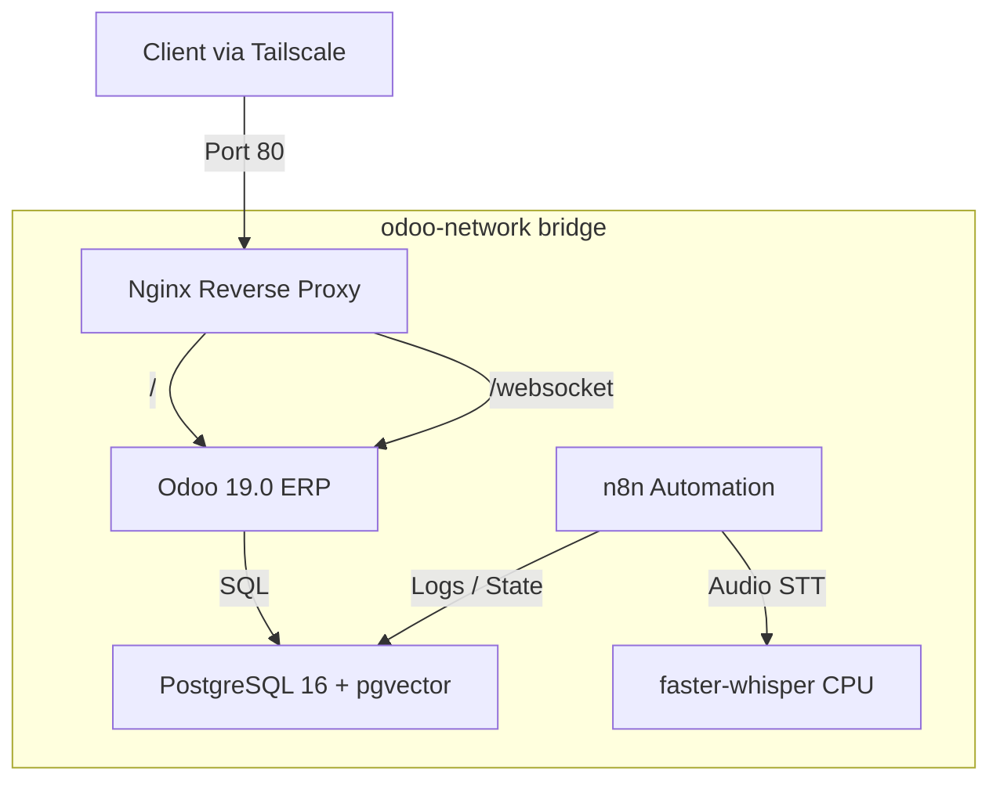

# docker

> Consolidated Odoo 19 + AI + PostgreSQL Docker Compose stack.

## 🗺️ Visual Component Map

## 📄 Description and Context

This folder contains the production-quality Compose definition that runs inside the unprivileged LXC 100 container. Only Nginx exposes a port (`80/tcp`); Whisper and n8n remain internal and communicate through the `odoo-network` bridge.

## 🔗 System Links

* **Parent context:** [README](../README.md)
* **Dependencies:**
  * [RESOURCE-BUDGET](../docs/RESOURCE-BUDGET.md) — memory limits assigned here
  * [HOST-TUNING](../docs/HOST-TUNING.md) — kernel flags that allow nesting inside LXC 100
  * `nginx/nginx.conf` — single ingress point
  * `postgres/init/01-init.sql` — database bootstrap including `pgvector`
