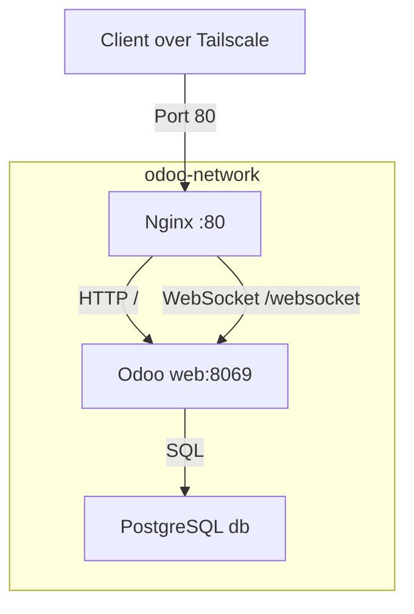

# docker/nginx

> Zero-exposure reverse proxy for the Odoo + AI stack.

## 🗺️ Visual Component Map

## 📄 Description and Context

`nginx.conf` is the single ingress point for the application stack. It proxies HTTP traffic to Odoo on `web:8069` and upgrades WebSocket connections on `/websocket`. No other service ports are exposed outside the Docker network.

## 🔗 System Links

* **Parent context:** [docker/README](../README.md)
* **Interfaces:**
  * **Input:** Port `80` bound to `PROXY_BIND_IP` (LXC/Tailscale IP) from the LXC 100 host / Tailscale mesh
  * **Output:** `web:8069` (Odoo HTTP) and `web:8072` (Odoo longpolling / WebSocket)
* **Dependencies:**
  * `odoo-network` bridge defined in `../compose.yaml`
  * `web` container started and healthy
