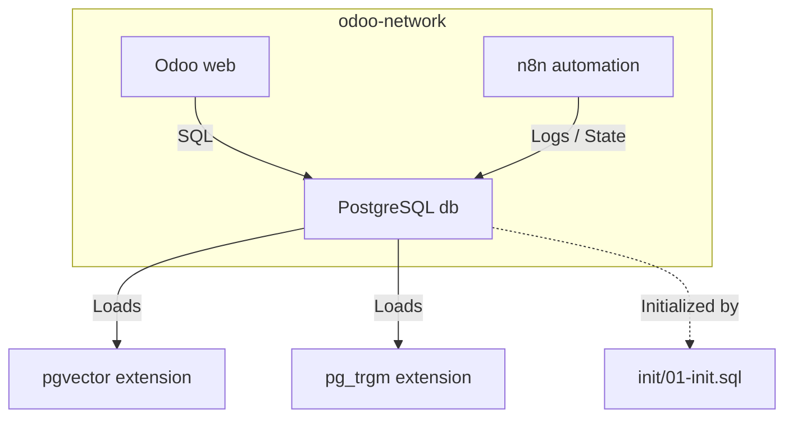

# docker/postgres

> PostgreSQL 16 with pgvector for the Odoo + n8n stack.

## 🗺️ Visual Component Map

## 📄 Description and Context

The `db` service runs `pgvector/pgvector:pg16` with a hard 4 GB memory cap and `huge_pages=off`. Initialization scripts in `init/` are mounted read-only into `/docker-entrypoint-initdb.d` and execute only on the first volume creation.

## 🔗 System Links

* **Parent context:** [docker/README](../README.md)
* **Interfaces:**
  * **Input:** SQL connections from `web` (Odoo) and `automation-pipeline` (n8n)
  * **Output:** `pgvector` index support for RAG / semantic search
* **Dependencies:**
  * `init/01-init.sql` — activates `pgvector` and `pg_trgm`
  * `odoo-db-data` named volume — persistent data store
