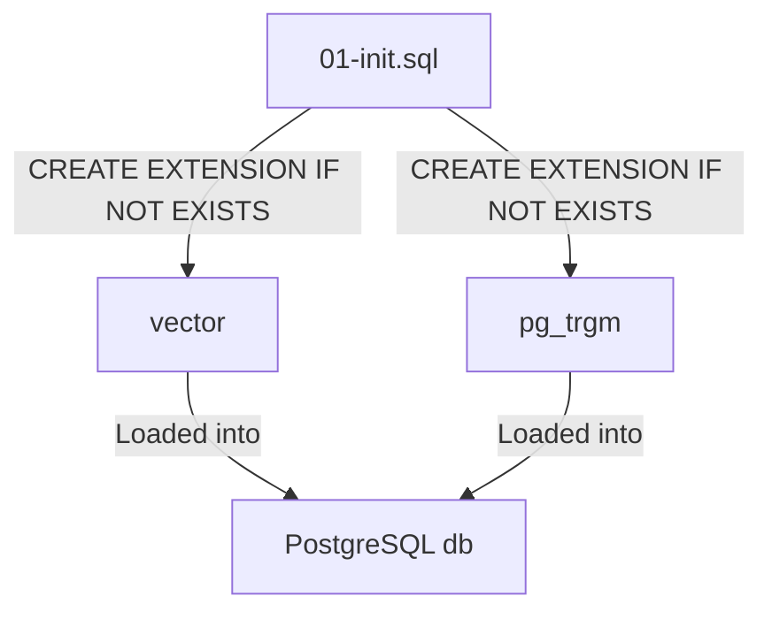

# docker/postgres/init

> Idempotent PostgreSQL initialisation scripts.

## 🗺️ Visual Component Map

## 📄 Description and Context

This directory contains one-shot SQL executed by the Postgres entrypoint when the data volume is first initialised. The scripts are intentionally minimal and idempotent so re-creating the volume is safe, but dropping and re-creating extensions here is not needed during normal operation.

## 🔗 System Links

* **Parent context:** [docker/postgres/README](../README.md)
* **Interfaces:**
  * **Output:** `vector` and `pg_trgm` extensions inside the `db` container on first start
* **Dependencies:**
  * `pgvector/pgvector:pg16` image
