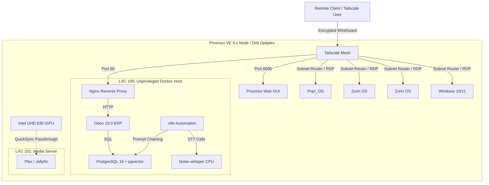

# Architecture

> High-level design of the `pve-node-iac` single-node Proxmox home lab.

## Visual topology

## Core design decisions

1. **Single unprivileged LXC sandbox (LXC 100)**
   - Odoo, PostgreSQL, n8n and Whisper share one nesting container instead of being split into dedicated KVM VMs.
   - This removes ~2 GB of KVM overhead and lets the kernel share resources dynamically.

2. **Unprivileged nesting**
   - `unprivileged: 1`
   - `features: nesting=1,keyctl=1`
   - `CAP_SYS_ADMIN` is not granted, which reduces container-escape risk.

3. **Hugepages disabled**
   - Unprivileged containers cannot manipulate host hugepage namespaces.
   - PostgreSQL therefore runs with `huge_pages=off` to avoid permission faults during init.

4. **Named Docker volumes**
   - Bind mounts are avoided. Named volumes let the Docker daemon inside the unprivileged LXC handle UID/GID mapping for services such as PostgreSQL (UID 999) without manual `subuid`/`subgid` tuning.

5. **Zero-exposure ingress**
   - Only the Nginx reverse proxy publishes `80/tcp`.
   - Whisper (`8000/tcp`) and n8n (`5678/tcp`) are internal to the Docker network and reachable only through Nginx (or Tailscale subnet routing for adjacent VMs).

## Related decisions

* Hardware constraints and BOM: [HARDWARE](HARDWARE.md)
* Memory allocation matrix: [RESOURCE-BUDGET](RESOURCE-BUDGET.md)
* Kernel tuning details: [HOST-TUNING](HOST-TUNING.md)
* Backup and cold-start recovery: [DISASTER-RECOVERY](DISASTER-RECOVERY.md)
