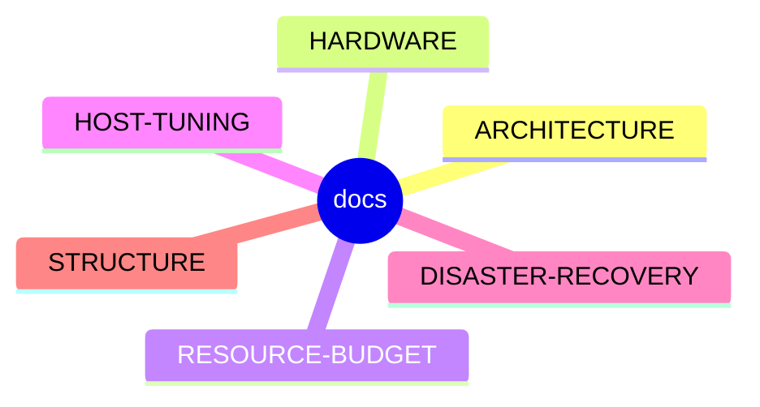

# docs

> Architectural and operational documentation for the `pve-node-iac` project.

## 🗺️ Visual Component Map

## 📄 Description and Context

This directory holds the written design rationale for the single-node Proxmox lab. The files answer the *why* behind the IaC files: hardware limits, memory allocation, kernel tuning and recovery procedures.

## 🔗 System Links

* **Parent context:** [README](../README.md)
* **Dependencies:**
  * [stack_badges](../stack_badges.md) — for the full technology catalog
  * `../docker/compose.yaml` — the stack described by these documents
  * `../proxmox/lxc/*.conf` — container profiles referenced from HOST-TUNING
