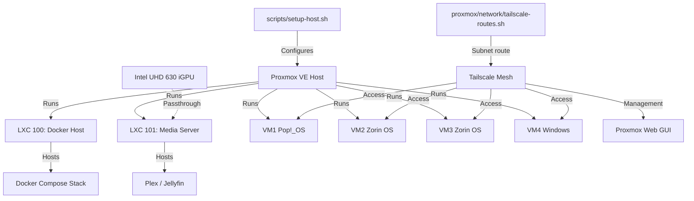

# proxmox

> Proxmox VE layer: LXC container profiles and host networking.

## 🗺️ Visual Component Map

## 📄 Description and Context

This directory holds Proxmox-specific configuration that lives outside the containers: LXC `.conf` files for LXC 100 and LXC 101, plus the Tailscale subnet-router script used on the bare-metal host.

## 🔗 System Links

* **Parent context:** [README](../README.md)
* **Subsystems:**
  * [lxc](lxc/README.md) — LXC 100 and LXC 101 container configurations
  * [network](network/README.md) — Tailscale subnet routing helper
* **Dependencies:**
  * [HOST-TUNING](../docs/HOST-TUNING.md) — describes the GRUB / sysctl settings Proxmox needs
  * `scripts/setup-host.sh` — applies host-level Proxmox tuning
