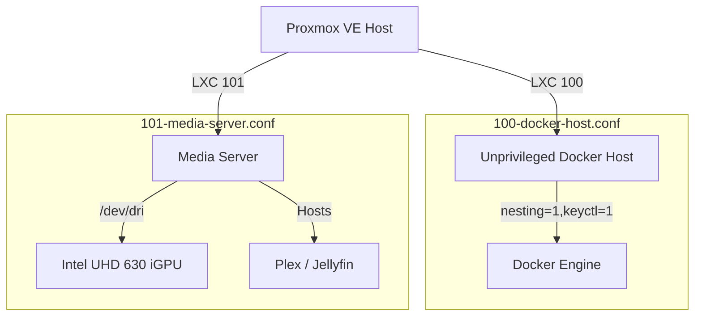

# proxmox/lxc

> LXC container profiles for the application and media workloads.

## 🗺️ Visual Component Map

## 📄 Description and Context

Two unprivileged containers run on the Proxmox host:

* **LXC 100** is the Docker nesting host. It uses `nesting=1,keyctl=1` and a 10 GB memory ceiling.
* **LXC 101** is the media server. It passes through `/dev/dri` for Intel QuickSync transcoding and is capped at 2 GB RAM.

## 🔗 System Links

* **Parent context:** [proxmox/README](../README.md)
* **Interfaces:**
  * **LXC 100 output:** Docker Compose stack defined in `../../docker/compose.yaml`
  * **LXC 101 output:** iGPU-backed `/dev/dri/renderD128` to Plex/Jellyfin
* **Dependencies:**
  * `proxmox/lxc/100-docker-host.conf`
  * `proxmox/lxc/101-media-server.conf`
  * [HOST-TUNING](../../docs/HOST-TUNING.md)
