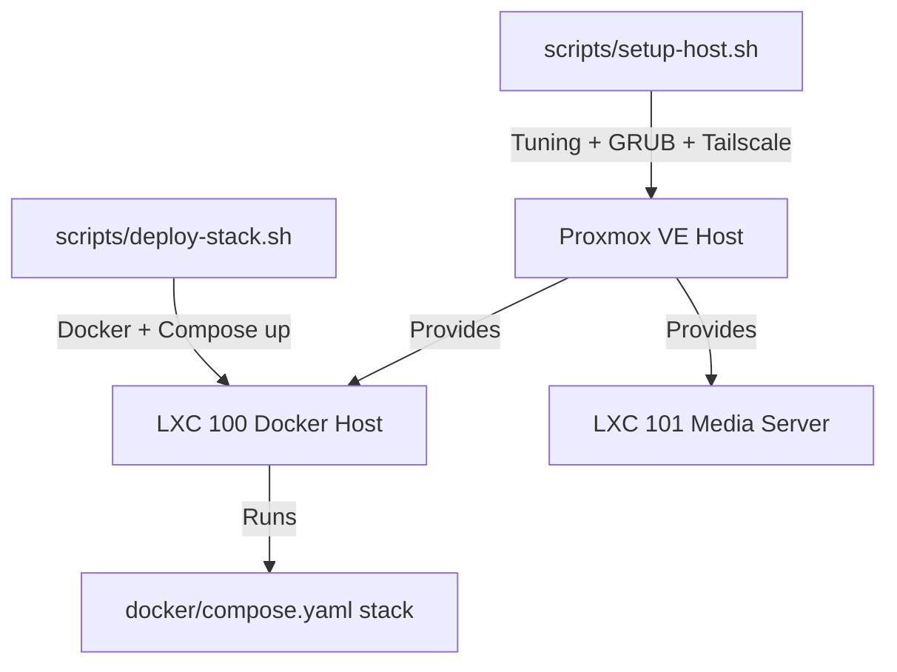

# scripts

> Idempotent automation for host tuning and stack deployment.

## 🗺️ Visual Component Map

## 📄 Description and Context

This directory contains the two main operational scripts:

* `setup-host.sh` — runs once on the bare-metal Proxmox host to apply sysctl tuning, update GRUB, configure VZDump fleecing and enable Tailscale subnet routing.
* `deploy-stack.sh` — runs inside LXC 100 to install Docker Engine (if missing) and bring up the Compose stack, then waits for the PostgreSQL healthcheck (which includes the `pgvector` check).

Both scripts use `set -euo pipefail`, a root check and `[OK]/[FAIL]` logging.

## 🔗 System Links

* **Parent context:** [README](../README.md)
* **Interfaces:**
  * **Input:** `TAILSCALE_AUTH_KEY` (setup-host) and a populated `docker/.env` (deploy-stack)
  * **Output:** tuned host and running application stack
* **Dependencies:**
  * [HOST-TUNING](../docs/HOST-TUNING.md) — documents the settings applied by `setup-host.sh`
  * [DISASTER-RECOVERY](../docs/DISASTER-RECOVERY.md) — documents the cold-start sequence
  * `../docker/compose.yaml` — stack deployed by `deploy-stack.sh`
